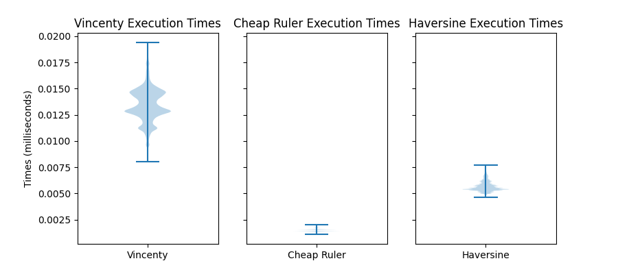
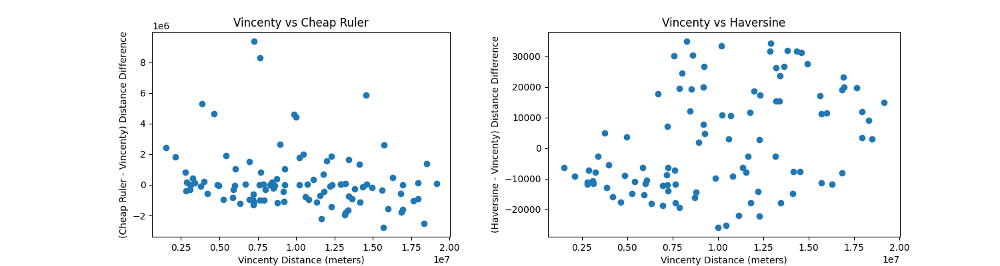

# Comparing Lon-Lat Distance Functions
## Execution Time for 1,000,000 Pairs of Random Points
 
1,000,000 pairs of random points were created. Each point had a valid longitude and latitude value (the longitude was a random number between $-180$ and $180$ while the latitude was a random number between $-90$ and $90$)

The distance between each pair of random points was calculated with each distance function. Each function used the same pairs of points. Here are the times it took to calculate the distance between all 1,000,000 pairs:

 - Vincenty: 13.3743638 seconds
 - Cheap Ruler: 1.6893626000000026 seconds
 - Haversine: 2.408093000000001 seconds
## Violin Plots for Individual Execution Times
Here are violin plots of the distribution of execution times for all 1,000,000 pairs of points for each distance function:

 
## Error Plots for Cheap Ruler and Haversine compared to Vincenty
Assuming that Vincenty is the gold standard for computing distances, here are the error scatterplots showing the difference between the distances calculated with Vincenty to Cheap Ruler and Haversine:

Please note that Vincenty sometimes returns None when given a pair of points to find the distance of. These cases are omitted from these plots

## Analysis
Both Haversine and Cheap Ruler are about 10 seconds faster than Vincenty when calculating the 1,000,000 points. So for optimizing runtime, Haversine and Cheap Ruler are ideal with Cheap Ruler having a slight advantage.

Cheap Ruler, however, has a wide, problematic range of error. Haversine, in comparison, has an error range orders of magnitude smaller than Cheap Ruler.

If one wants to try to minimize runtimes while trying to preserve the accuracy of the distance function, then Haversine is the optimal distance function compared to Vincenty and Haversine.
