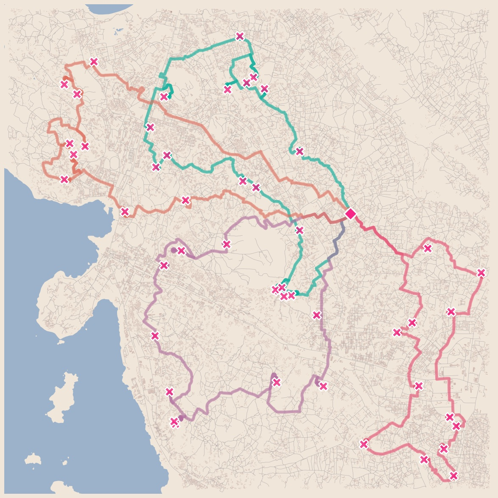
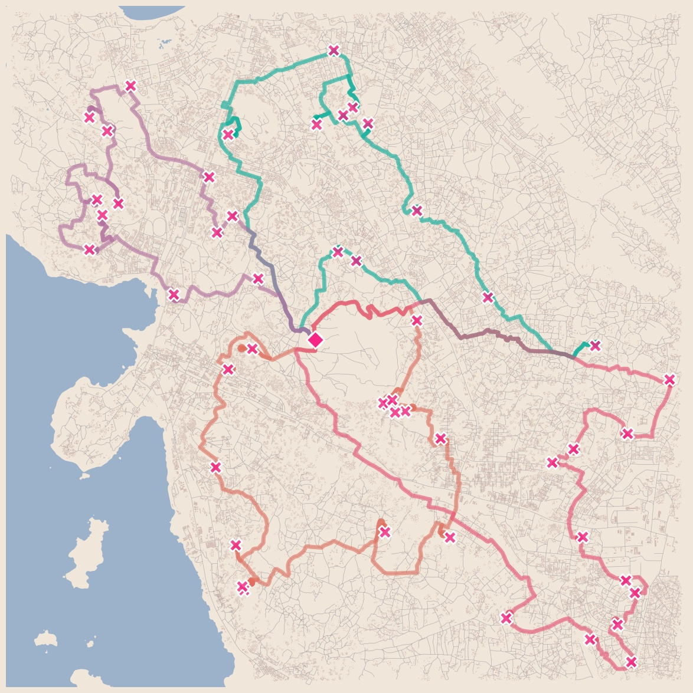

Future Directions
=====================

Banning Sites
--------------

A simple extension to the discrete optimization case, we will be adding the option to set a group of sites that are not to be taken into account for optimization purposes.
This extension is meant to provide with a way to setup households or populations that are not willing to lay a trap within their property but that need to be taken into account as possible sites which mosquitoes can traverse.

Surveillance Routing
---------------------

One major extension...

|pic1| |pic2|

Optimizing Trap Types
-----------------------