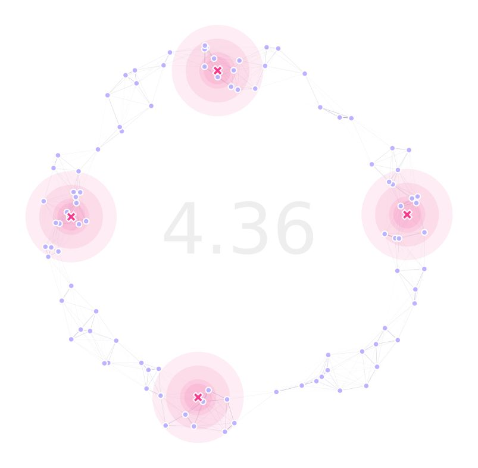

GA Optimization
------------

In this demo, we will be optimizing the traps' positions to minimize the time it takes for a mosquito to get caught.
This is done with the `DEAP package <https://deap.readthedocs.io/en/master/>`_, as it allows much flexibility and implementation speedups.

Landscape and Traps
~~~~~~~~~~~~~~~~~~~~~~

We are going to use a "donut" landscape as a testbed, so we define our pointset as:

.. code-block:: python

    ptsNum = 100
    radii = (75, 100)
    xy = srv.ptsDonut(ptsNum, radii).T
    points = pd.DataFrame({'x': xy[0], 'y': xy[1], 't': [0]*xy.shape[1]})
    mKer = {'params': [.075, 1.0e-10, math.inf], 'zeroInflation': .75}

And, as we are going to optimize our traps locations, we can define them all at coordinates :code:`(0,0)`, and for this example we are assuming
all the traps are the same type (:code:`t=0`) and that they are all movable (:code:`f=0`):

.. code-block:: python

    nullTraps = [0, 0, 0, 0]
    traps = pd.DataFrame({
        'x': nullTraps, 'y': nullTraps,
        't': nullTraps, 'f': nullTraps
    })
    tKer = {0: {'kernel': srv.exponentialDecay, 'params': {'A': .5, 'b': .1}}}

With our landscape object being setup as:

.. code-block:: python

    lnd = srv.Landscape(
        points, kernelParams=mKer,
        traps=traps, trapsKernels=tKer
    )
    bbox = lnd.getBoundingBox()

Genetic Algorithm
~~~~~~~~~~~~~~~~~~~~~~

To get started with setting up the 

.. code-block:: python

    (GENS, VERBOSE) = (2000, True)
    POP_SIZE = int(10*(lnd.trapsNumber*1.25))
    MAT = {'mate': .5, 'cxpb': 0.5}, 
    MUT = {'mean': 0, 'sd': max([i[1]-i[0] for i in bbox])/4, 'mutpb': .5, 'ipb': .5},
    SEL = {'tSize': 3}
    trpMsk = srv.genFixedTrapsMask(lnd.trapsFixed)

Next, as defined by the `DEAP docs <https://deap.readthedocs.io/en/master/examples/index.html>`_, we register all the functions and operations
that we are going to use in our optimization cycle. For this version, we'll be using a pretty "vanilla" GA with
cxBlend, gaussian mutation, and tournament selection.

.. code-block:: python

    toolbox = base.Toolbox()
    creator.create("FitnessMin", base.Fitness, weights=(-1.0, ))
    # Population creation -----------------------------------------------------
    creator.create(
        "Individual", list, 
        fitness=creator.FitnessMin
    )
    toolbox.register(
        "initChromosome", srv.initChromosome, 
        trapsCoords=lndGA.trapsCoords, 
        fixedTrapsMask=trpMsk, coordsRange=bbox
    )
    toolbox.register(
        "individualCreator", tools.initIterate, 
        creator.Individual, toolbox.initChromosome
    )
    toolbox.register(
        "populationCreator", tools.initRepeat, 
        list, toolbox.individualCreator
    )
    # Mutation and Crossover --------------------------------------------------
    toolbox.register(
        "mate", srv.cxBlend, 
        fixedTrapsMask=trpMsk, alpha=MAT['mate']
    )
    toolbox.register(
        "mutate", srv.mutateChromosome, 
        fixedTrapsMask=trpMsk, 
        randArgs={'loc': MUT['mean'], 'scale': MUT['sd']}
    )
    # Select and evaluate -----------------------------------------------------
    toolbox.register(
        "select", tools.selTournament, 
        tournsize=SEL['tSize']
    )
    toolbox.register(
        "evaluate", srv.calcFitness, 
        landscape=lndGA,
        optimFunction=srv.getDaysTillTrapped,
        optimFunctionArgs={'outer': np.mean, 'inner': np.max}
    )

It is important to note that we provide custom implementations for the :code:`initChromosome`, :code:`cxBlend`, and :code:`mutateChromosome`; 
to allow immovable traps to be laid in the landscape, but we will stick to `DEAP's' <https://deap.readthedocs.io/en/master/>`_ implementations for this first exercise.

We now register summary statistics for our algorithm:

.. code-block:: python

    pop = toolbox.populationCreator(n=POP_SIZE)
    hof = tools.HallOfFame(1)
    stats = tools.Statistics(lambda ind: ind.fitness.values)   
    stats.register("min", np.min)
    stats.register("avg", np.mean)
    stats.register("max", np.max)
    stats.register("traps", lambda fitnessValues: pop[fitnessValues.index(min(fitnessValues))])
    stats.register("best", lambda fitnessValues: fitnessValues.index(min(fitnessValues)))

Where the statistics go as follow (more stats can be added as needed):

* :code:`min`: Traps' population minimum fitness (best in generation).
* :code:`avg`: Traps' population average fitness.
* :code:`max`: Traps' population maximum fitness (worst in generation).
* :code:`traps`: Best traps positions in the current generation.
* :code:`best`: Best fitness across populations.

Now, we run our optimization cycle:

.. code-block:: python

    (pop, logbook) = algorithms.eaSimple(
        pop, toolbox, cxpb=MAT['cxpb'], mutpb=MUT['mutpb'], ngen=GENS, 
        stats=stats, halloffame=hof, verbose=VERBOSE
    )

This will take some time depending on the number of generations and the size of the landscape/traps (check out our `benchmarks <./benchmarks.html>`_ for more info) but once it's done running, we can get our resulting optimized positions by running:

Summary and Plotting
~~~~~~~~~~~~~~~~~~~~~~

Having the results of the GA in our hands, we can get our best chromosome (stored in the :code:`hof` object) and re-shape it so that it is structured as traps locations:

.. code-block:: python

    bestChromosome = hof[0]
    bestPositions = np.reshape(bestChromosome, (-1, 2))

With these traps locations, we can update our landscape and get the stats for the GA logbook object in a dataframe form:

.. code-block:: python

    lnd.updateTrapsCoords(bestTraps)
    dta = pd.DataFrame(logbook)

We can now plot our landscape with optimized traps positions:

.. code-block:: python

    (fig, ax) = plt.subplots(1, 1, figsize=(15, 15), sharey=False)
    lnd.plotSites(fig, ax, size=100)
    lnd.plotMigrationNetwork(fig, ax, alphaMin=.6, lineWidth=25)
    lnd.plotTraps(fig, ax)
    srv.plotClean(fig, ax, frame=False, bbox=bbox)
    srv.plotFitness(fig, ax, min(dta['min']))
    fig.savefig(
        path.join(OUT_PTH, '{}_TRP.png'.format(ID)), 
        facecolor='w', bbox_inches='tight', pad_inches=0, dpi=300
    )

The code used for this tutorial can be found `in this link <https://github.com/Chipdelmal/MGSurvE/blob/main/MGSurvE/demos/Demo_XY.py>`_
