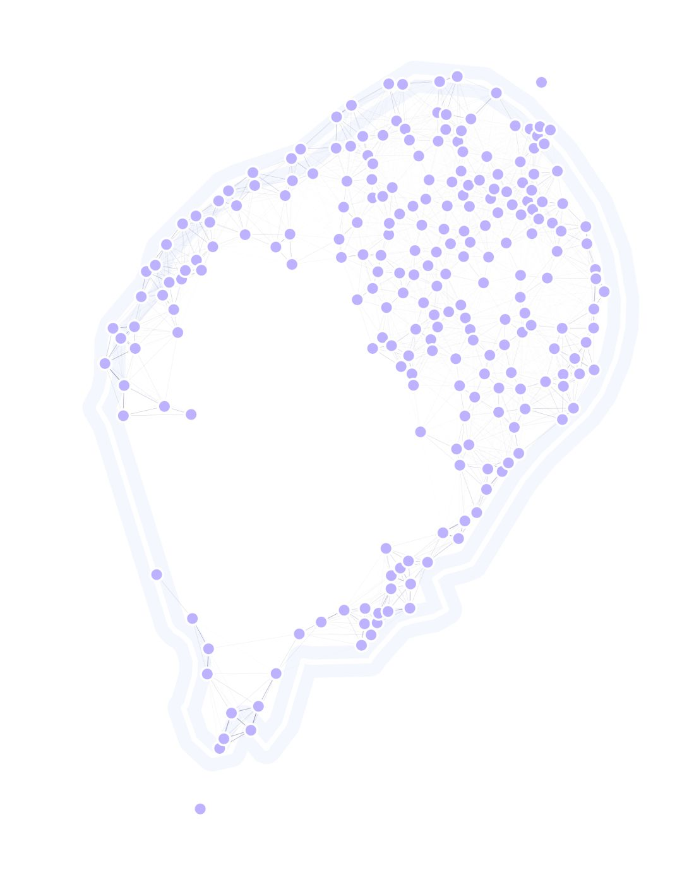

GA in a Realistic Landscape
------------

In this example, we will be testing some of `MGSurvE <https://github.com/Chipdelmal/MGSurvE>`_'s capabilities to optimize realistic landscapes.
We will use the São Tomé landscape (in equatorial Africa) to test out an optimal positioning of traps to minimize time to detection of a transgene.

Reading Spatial Information
~~~~~~~~~~~~~~~~~~~~~~

.. code-block:: python

    sites = pd.read_csv(path.join(OUT_PTH, 'GEO', 'stp_cluster_sites_pop_v5_fixed.csv'))
    sites['t'] = [0]*sites.shape[0]
    SAO_TOME_LL = sites.iloc[IX_SPLIT:]
    SAO_bbox = (
        (min(SAO_TOME_LL['lon']), max(SAO_TOME_LL['lon'])),
        (min(SAO_TOME_LL['lat']), max(SAO_TOME_LL['lat']))
    )
    SAO_TOME_LL = SAO_TOME_LL .rename(
        columns={'lon': 'x', 'lat': 'y'}
    )
    SAO_LIMITS = ((6.41, 6.79), (-0.0475, .45))