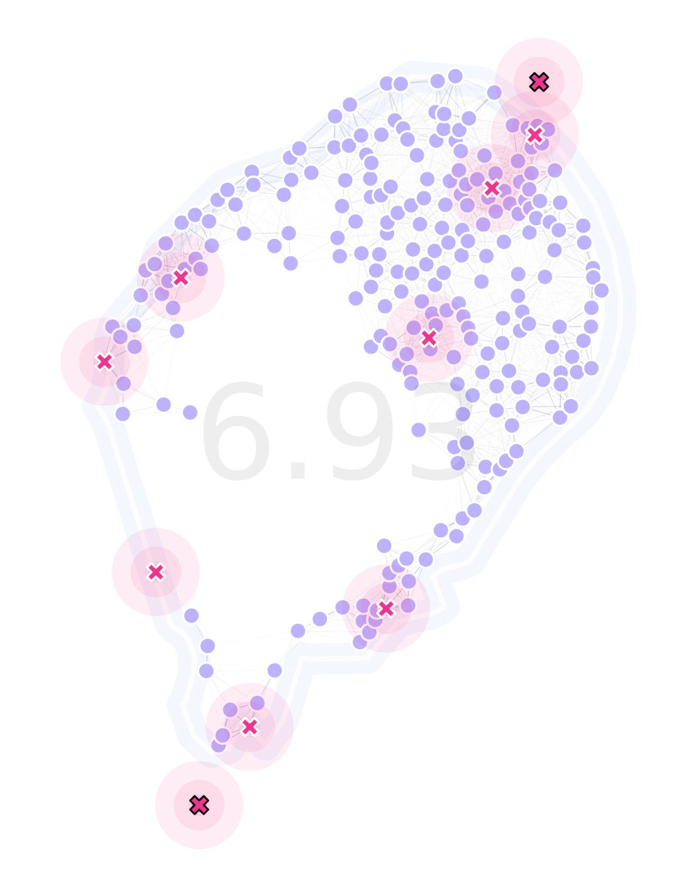

Discrete GA in a Realistic Landscape 
------------

In this example, we will compare the results obtained in our `realistic landscape continuous optimization demo <https://chipdelmal.github.io/MGSurvE/build/html/GA_STP.html>`_ with the optimization done in a discrete-based setting.

Setting Landscape Up
~~~~~~~~~~~~~~~~~~~~~~

The first thing we need to do is to generate our traps dataframe with its :code:`sid`'s (explained in the `"GA Discrete Optimization" tutorial <https://chipdelmal.github.io/MGSurvE/build/html/GA_discrete.html>`_). 
In this case, we know we want two traps to be located in the northernmost and southernmost islands of the main body of land (which correspond to the indices 24 and 212 of our sites):

.. code-block:: python

    # Defining the indices of our fixed traps
    SAO_FIXED = [24, 212]
    if FXD_TRPS:
        initFxd = ([0]*(TRPS_NUM-FXD_NUM) + [1]*FXD_NUM)
    sid = [0]*(TRPS_NUM-FXD_NUM) + SAO_FIXED 
    # Generating our traps dataframe
    traps = pd.DataFrame({
        'sid': sid,
        'lon': initLon, 'lat': initLat, 
        't': initTyp, 'f': initFxd
    })

With this in place, we generate our landscape object as follows:

.. code-block:: python

    lnd = srv.Landscape(
        SAO_TOME_LL, 
        migrationMatrix=SAO_TOME_MIG,
        traps=traps, trapsKernels=tKer, 
        landLimits=SAO_LIMITS,
        trapsRadii=[.75, .5, .3],
    )

Setting GA Up
~~~~~~~~~~~~~~~~~~~~~~

Similar to our `previous tutorial <https://chipdelmal.github.io/MGSurvE/build/html/GA_discrete.html>`_, we change the registered functions on our GA for their discrete versions:

.. code-block:: python

    # Chromosome initializer
    toolbox.register(
        "initChromosome", srv.initDiscreteChromosome, 
        ptsIds=lndGA.pointID, 
        fixedTraps=lndGA.trapsFixed, 
        trapsSiteID=lndGA.trapsSiteID,
        banSites=lndGA.pointsTrapBanned
    )
    # Mating operator
    toolbox.register(
        "mate", srv.cxDiscreteUniform, 
        fixedTraps=lndGA.trapsFixed,
        indpb=MAT['indpb']
    )
    # Mutation operator
    toolbox.register(
        "mutate", srv.mutateDiscreteChromosome,
        ptsIds=lndGA.pointID, 
        fixedTraps=lndGA.trapsFixed,
        indpb=MUT['indpb'],
        banSites=lndGA.pointsTrapBanned
    )
    # Chromosome evaluation function
    toolbox.register(
        "evaluate", srv.calcDiscreteFitness, 
        landscape=lndGA,
        optimFunction=srv.getDaysTillTrappedPseudoInverse,
        optimFunctionArgs={'outer': np.mean, 'inner': np.max}
    )

For more information on these operators, have a look at their `API <https://chipdelmal.github.io/MGSurvE/build/html/generated/MGSurvE.optimization.html#module-MGSurvE.optimization>`_ entries. 

Result
~~~~~~~~~~~~~~~~~~~~~~

