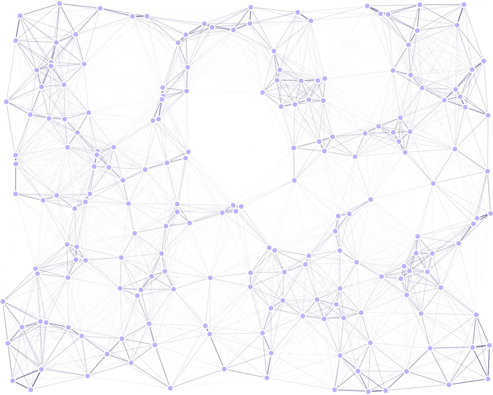
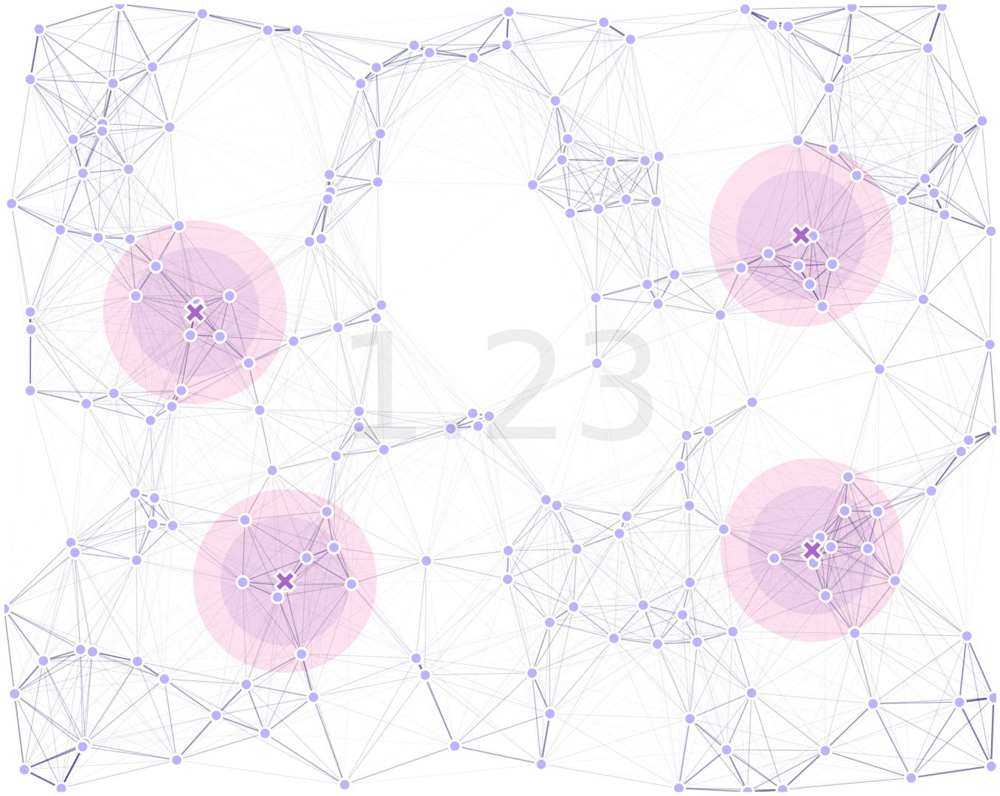
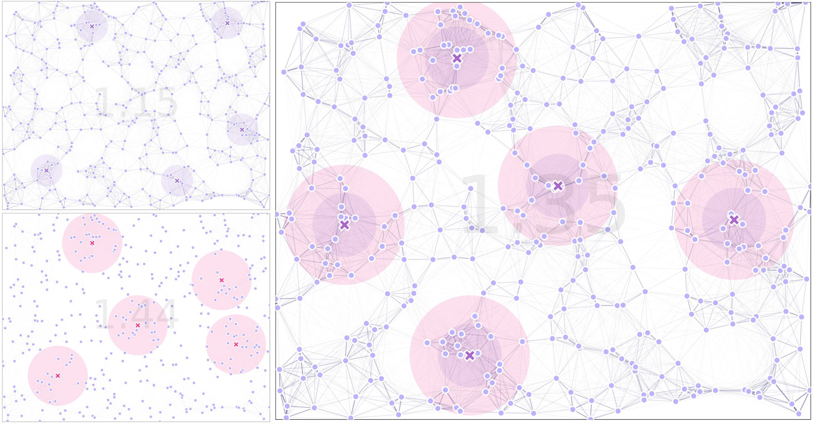

GA with Sex Kernels
------------

`MGSurvE <https://github.com/Chipdelmal/MGSurvE>`_ can be used to optimize movement kernels that depend on the sex of individuals.
In this tutorial, we will show an example of this by optimizing a landscape with males and females, and showing how encoding this information changes the result of the GA algorithm.

The Workflow
~~~~~~~~~~~~~~~~~~~~~~

The way `MGSurvE <https://github.com/Chipdelmal/MGSurvE>`_ encodes sex-based information is by generating different landscapes and combining the information in the GA fitness function.
This can be summarized in the following diagram:

.. image:: ../../img/MGSurvEDiagMultiSex.png

In which the information of the movement mask, traps kernels, and migration kernels; are sex-based, while the rest of the information is common to both landscapes.

Defining Movement
~~~~~~~~~~~~~~~~~~~~~~

We will use a random uniform points placement for our landscape:

.. code-block:: python

    ptsNum = 200
    bbox = ((-100, 100), (-80, 80))
    xy = srv.ptsRandUniform(ptsNum, bbox).T
    points = pd.DataFrame({'x': xy[0], 'y': xy[1], 't': [0]*xy.shape[1]})

with two types of movement kernels. We will define males as being more mobile than females for testing purposes:

.. code-block:: python

    movementKernel = {
        'Male': {
            'kernelFunction': srv.zeroInflatedExponentialKernel,
            'kernelParams': {
                'params': [.050, 1.0e-10, math.inf], 'zeroInflation': .5
            }
        },
        'Female': {
            'kernelFunction': srv.zeroInflatedExponentialKernel,
            'kernelParams': {
                'params': [.025, 1.0e-10, math.inf], 'zeroInflation': .7
            }
        }
    }

Defining Traps
~~~~~~~~~~~~~~~~~~~~~~

For our traps, we will definte male traps to be less efficient at capturing individuals than females:

.. code-block:: python

    nullTraps = [0] * TRPS_NUM
    traps = pd.DataFrame({'x': nullTraps, 'y': nullTraps, 'f': nullTraps, 't': nullTraps})
    tKernels = {
        'Male': {
            0: {'kernel': srv.exponentialDecay, 'params': {'A': .5, 'b': .06}}
        },
        'Female': {
            0: {'kernel': srv.exponentialDecay, 'params': {'A': .75, 'b': .04}}
        }
    }

both in terms of radius and actual trapping efficiency.

Setting Landscape Up
~~~~~~~~~~~~~~~~~~~~~~

With that in place, we can define our male and female landscapes independently:

.. code-block:: python

    lndM = srv.Landscape(
        points, traps=traps,
        kernelFunction=movementKernel['Male']['kernelFunction'],
        kernelParams=movementKernel['Male']['kernelParams'],
        trapsKernels=tKernels['Male'], trapsRadii=[.1, ]
    )
    lndF = srv.Landscape(
        points, traps=traps,
        kernelFunction=movementKernel['Female']['kernelFunction'],
        kernelParams=movementKernel['Female']['kernelParams'],
        trapsKernels=tKernels['Female'], trapsRadii=[.1, ]
    )

As mentioned before, we are going to create two separate landscapes and "link them" together through the optimizer.

Setting GA Up
~~~~~~~~~~~~~~~~~~~~~~

In terms of the GA, most of the code remains the same, except that in the :code:`calcSexFitness` function, 
we might want to define which sex should take priority in terms of catches for the optimizer. We do this
by defining a "weight" for each one:

.. code-block:: python

    (weightMale, weightFemale) = (.5, 1)
    POP_SIZE = int(10*(lndM.trapsNumber*1.25))
    (MAT, MUT, SEL) = (
        {'mate': .3, 'cxpb': 0.5}, 
        {'mean': 0, 'sd': min([i[1]-i[0] for i in bbox])/5, 'mutpb': .4, 'ipb': .5},
        {'tSize': 3}
    )
    lndM_GA = deepcopy(lndM)
    lndF_GA = deepcopy(lndF)

We register the same functions as we did before for everything except the fitness function:

.. code-block:: python

    toolbox = base.Toolbox()
    creator.create("FitnessMin", 
        base.Fitness, weights=(-1.0, )
    )
    creator.create("Individual", 
        list, fitness=creator.FitnessMin
    )
    toolbox.register("initChromosome", srv.initChromosome, 
        trapsCoords=lndM_GA.trapsCoords, 
        fixedTrapsMask=trpMsk, coordsRange=bbox
    )
    toolbox.register("individualCreator", tools.initIterate, 
        creator.Individual, toolbox.initChromosome
    )
    toolbox.register("populationCreator", tools.initRepeat, 
        list, toolbox.individualCreator
    )
    toolbox.register(
        "mate", tools.cxBlend, 
        alpha=MAT['mate']
    )
    toolbox.register(
        "mutate", tools.mutGaussian, 
        mu=MUT['mean'], sigma=MUT['sd'], indpb=MUT['ipb']
    )
    toolbox.register("select", 
        tools.selTournament, tournsize=SEL['tSize']
    )

The reason why we can use the same mutation, selection, and crossover functions is because the traps' positions are common to both landscapes, 
so we can modify them and just calculate the combined fitness of both.

For the fitness, we will use :code:`calcSexFitness` defined in `MGSurvE <https://github.com/Chipdelmal/MGSurvE>`_'s implementation. 
This function takes the two landscapes and calculates the fitness as a weighted average of the calculations of the two separate optimization functions:

.. code-block:: python

    toolbox.register("evaluate", 
        srv.calcSexFitness, 
        landscapeMale=lndM_GA,landscapeFemale=lndF_GA,
        weightMale=weightMale, weightFemale=weightFemale,
        optimFunction=srv.getDaysTillTrapped,
        optimFunctionArgs={'outer': np.mean, 'inner': np.max}
    )

For the code on the optimization function, have a look at this `link <https://github.com/Chipdelmal/MGSurvE/blob/main/MGSurvE/optimization.py>`_.

Run Optimizer
~~~~~~~~~~~~~~~~~~~~~~

We are now ready to run our optimizer as we have done in previous examples:

.. code-block:: python

    (pop, logbook) = algorithms.eaSimple(
        pop, toolbox, cxpb=MAT['cxpb'], mutpb=MUT['mutpb'], ngen=GENS, 
        stats=stats, halloffame=hof, verbose=VERBOSE
    )

Results
~~~~~~~~~~~~~~~~~~~~~~

After our code was run, we get the following result:

where the traps' effectiveness radii for male (purple) and female (magenta), are highlighted and the combined fitness is displayed in text.

As a final note, we want to highlight that this is a simple way to combine the information on both kernels, but different implementations involving multi-objective optimizations can be implemented and used within both `MGSurvE <https://github.com/Chipdelmal/MGSurvE>`_ and `DEAP <https://deap.readthedocs.io/en/master/>`_.

Another Example
~~~~~~~~~~~~~~~~~~~~~~

In our previous example, it was a bit difficult to see the difference in using the two kernels for movement and traps, but 
we have coded a `pipeline <https://github.com/Chipdelmal/MoNeT_DA/tree/main/NET/MGS>`_ that exports the male (left top), female (left bottom), and combined landscapes (right) to compare the differences:

For the full code used in this demo, follow this `link <https://github.com/Chipdelmal/MGSurvE/blob/main/MGSurvE/optimization.py>`_. 