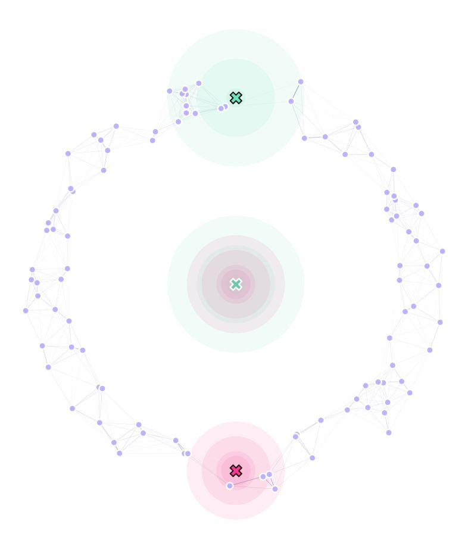
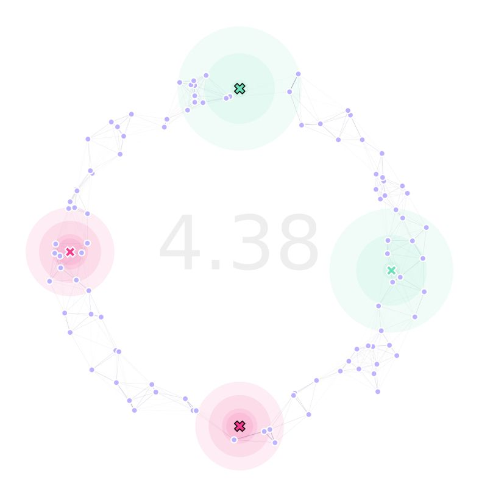

GA with Immovable Traps
------------

The combination of `MGSurvE <https://github.com/Chipdelmal/MGSurvE>`_ and `DEAP <https://deap.readthedocs.io/en/master/>`_ makes it easy to extend GA functions to accommodate specific needs.
In this tutorial, we will show how to use custom functions to optimize landscapes with immovable traps with different attractiveness levels.

Setting Traps Up
~~~~~~~~~~~~~~~~~~~~~~

In this example, we will use two types of traps: one with high trapping efficacy but short radius (0), and one with lower trapping efficacy but wider radius (1):

.. code-block:: python

    tKer = {
        0: {'kernel': srv.exponentialDecay, 'params': {'A': .5, 'b': .1}},
        1: {'kernel': srv.exponentialDecay, 'params': {'A': .25, 'b': .05}}
    }

To define our traps in the landscape, we setup all the movable traps in :code:`(0,0)` (just for convenience), and we will assume we need one trap located at the top of our ring environment :code:`(0,87.5)`, and one on the bottom :code:`(0,-87.5)` (both of which are immovable):

.. code-block:: python

    traps = pd.DataFrame({
        'x': [0, 0, 0, 0], 
        'y': [0, 0, -87.5, 87.5],
        't': [0, 1, 0, 1], 
        'f': [0, 0, 1, 1]
    })

Our landscape now looks like this:

Where the traps with outlined X marks, are immovable.

Built-in Custom Functions
~~~~~~~~~~~~~~~~~~~~~~

Now, if we used `DEAP's <https://deap.readthedocs.io/en/master/>`_ built-in creation, mutation, and crossover functions, all the traps would be moved to find the optimum traps' distribution.
As we want two of our traps to stay fixed in their positions, we are going to have to use different operators for these processes.
Fortunately, `MGSurvE <https://github.com/Chipdelmal/MGSurvE>`_ provides functions to do this: :code:`initChromosome`, :code:`cxBlend`, :code:`mutateChromosome`; which are based on `DEAP's <https://deap.readthedocs.io/en/master/>`_ original ones.

Taking a peek at `MGSurvE's <https://github.com/Chipdelmal/MGSurvE>`_ `mutateChromosome <https://github.com/Chipdelmal/MGSurvE/blob/main/MGSurvE/optimization.py>`_'s definition, we can see that it uses a "mask" to cover for the traps that are not going to be moved for optimization: 

.. code-block:: python

    def mutateChromosome(
            chromosome, fixedTrapsMask,
            randFun=rand.normal, 
            randArgs={'loc': 0, 'scale': 0.1}
        ):
        randDraw = randFun(size=len(chromosome), **randArgs)
        randMsk = randDraw * fixedTrapsMask
        chromosome[:] = chromosome + randMsk
        return (chromosome, )

With `initChromosome <https://github.com/Chipdelmal/MGSurvE/blob/main/MGSurvE/optimization.py>`_ and `cxBlend <https://github.com/Chipdelmal/MGSurvE/blob/main/MGSurvE/optimization.py>`_ having similar extensions for this case.

Registering GA
~~~~~~~~~~~~~~~~~~~~~~

To do our optimization, we will follow the previous example's structure, but with some minor modifications. 
The first one is to define our :code:`trpMsk` that will be needed for our custom functions (as previously mentioned):

.. code-block:: python

    lnd = srv.Landscape(
        points, kernelParams=mKer,
        traps=traps, trapsKernels=tKer
    )
    bbox = lnd.getBoundingBox()
    trpMsk = srv.genFixedTrapsMask(lnd.trapsFixed)

With this mask in place, we can register our custom functions for use in the GA:

.. code-block:: python

    toolbox.register(
        "initChromosome", srv.initChromosome, 
        trapsCoords=lndGA.trapsCoords, 
        fixedTrapsMask=trpMsk, coordsRange=bbox
    )
    toolbox.register(
        "mate", srv.cxBlend, 
        fixedTrapsMask=trpMsk, alpha=MAT['mate']
    )
    toolbox.register(
        "mutate", srv.mutateChromosome, 
        fixedTrapsMask=trpMsk, 
        randArgs={'loc': MUT['mean'], 'scale': MUT['sd']}
    )

And that's it. We can use all the predefined functions for selection and stats as we did before.

Optimize GA
~~~~~~~~~~~~~~~~~~~~~~

With this in place, we can use the same workflow as we did in our `previous example <https://chipdelmal.github.io/MGSurvE/build/html/GA.html>`_.

.. code-block:: python

    (pop, logbook) = algorithms.eaSimple(
        pop, toolbox, cxpb=MAT['cxpb'], mutpb=MUT['mutpb'], ngen=GENS, 
        stats=stats, halloffame=hof, verbose=VERBOSE
    )

Results
~~~~~~~~~~~~~~~~~~~~~~

After running our landscape optimization, our landscape looks like this:

Which kept the two traps as immovable in their place. We can verify this by inspecting :code:`lndGA.trapsCoords`:

.. code-block:: python

    array([
        [-64.97048981, -16.77172602],
        [ 89.41336563,  54.49760029],
        [  0.        , -87.5       ],
        [  0.        ,  87.5       ]
    ])

The code used for this tutorial can be found `in this link <https://github.com/Chipdelmal/MGSurvE/blob/main/MGSurvE/demos/Demo_GACustom.py>`_.
