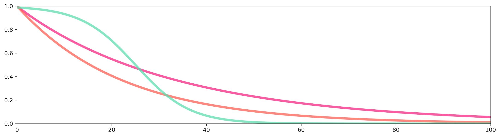

Visualizing Traps Kernels
------------

MGSurvE contains a tool to visualize traps kernels. 
To use it, we define a dummy landscape object (code available `here <https://github.com/Chipdelmal/MGSurvE/tree/main/MGSurvE/demos/Demo_Kernels.py>`_), and define our traps dictionary with some `predefined traps kernels <https://github.com/Chipdelmal/MGSurvE/blob/main/MGSurvE/kernels.py>`_:

.. code-block:: python

    tKer = {
        0: {
            'kernel': srv.exponentialAttractiveness,
            'params': {'A': 1, 'k': .01, 's': .3, 'gamma': .975, 'epsilon': 0}
        },
        1: {
            'kernel': srv.exponentialDecay, 
            'params': {'A': 1, 'b': 0.045}
        },
        2: {
            'kernel': srv.sigmoidDecay,     
            'params': {'A': 1, 'rate': .175, 'x0': 25}
        }
    }

And we plot their profiles with the following function:

.. code-block:: python

    lnd = srv.Landscape(points, traps=traps, trapsKernels=tKer)
    (fig, ax) = plt.subplots(1, 1, figsize=(15, 15), sharey=False)
    (fig, ax) = srv.plotTrapsKernels(
        fig, ax, lnd, 
        colors=TCOL, distRange=(0, 100), aspect=.25
    )

The full code for this demo can be found `here <https://github.com/Chipdelmal/MGSurvE/tree/main/MGSurvE/demos/Demo_Kernels.py>`_.