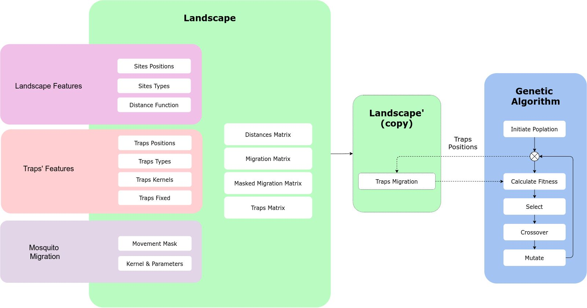
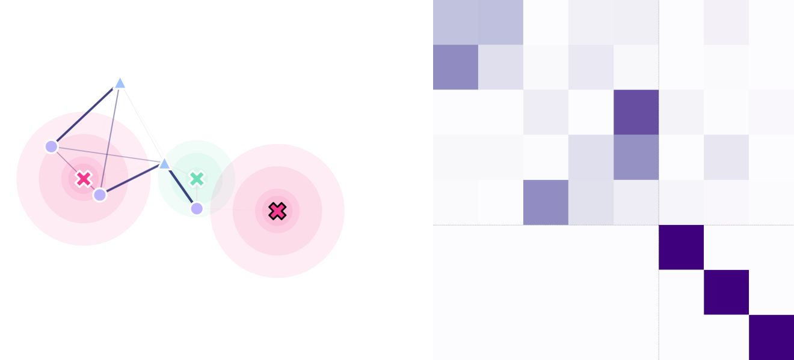

Pkg Breakdown
=====

`MGSurvE <https://github.com/Chipdelmal/MGSurvE>`_ is built around a `landscape <../html/generated/MGSurvE.landscape.html#module-MGSurvE.landscape>`_
object which stores the information of the sites' and traps' positions, along with the mosquito movement information. 

Workflow
------------

A general workflow in `MGSurvE <https://github.com/Chipdelmal/MGSurvE>`_ looks as follows:

1. Define point-set 
    a. Positions (pseudo-random or field data)
    b. Types (pseudo-random or field data)
2. Define mosquito movement type
    a. Movement kernel (package-provided or custom implementation)
3. Define traps'settings
    a. Positions (pseudo-random or field data)
    b. Types (pseudo-random or field data)
    c. Movable/Immovable (for optimization purposes)
4. Instantiate landscape object with info from previous steps
5. Setup `DEAP <https://deap.readthedocs.io/en/master/>`_ for Genetic-Algorithm (GA) optimization
    a. Register individual's and population creator
    b. Register mutation operator
    c. Register crossover operator
    d. Register selector operator
    e. Register fitness evaluator 
6. Run the GA optimizer
7. Update landscape and save results

Components 
------------

The :code:`landscape` object contains several elements that make it easy to define, calculate, plot and export our study sites.

Point Coordinates (:code:`lnd.pointCoords`)
~~~~~~~~~~~~~~~~~~~~~~

Traps Coordinates (:code:`lnd.trapsCoords`)
~~~~~~~~~~~~~~~~~~~~~~

Kernel Function (:code:`lnd.kernelFunction`)
~~~~~~~~~~~~~~~~~~~~~~

Traps Kernels (:code:`lnd.trapsKernels`)
~~~~~~~~~~~~~~~~~~~~~~

Distances Matrix (:code:`lnd.distanceMatrix`)
~~~~~~~~~~~~~~~~~~~~~~

This numpy array contains the distances between all the points in the landscape in the order that they are stored in the 
:code:`pointCoords`. This matrix is calculated point-wise by using the :code:`distance function` provided to the :code:`landscape` object.

Migration Matrix (:code:`lnd.migrationMatrix`)
~~~~~~~~~~~~~~~~~~~~~~

This matrix contains the probabilities of individuals to migrate from point :code:`a` (row) to point :code:`b` (column) across
the landscape in a time-step. This matrix is internally calculated using the :code:`kernel function` and the distance between sites.

Masked Migration Matrix (:code:`lnd.maskedMigration`)
~~~~~~~~~~~~~~~~~~~~~~

Similar to the :code:`migration matrix` but this matrix takes into account the point-types for the probability of movement 
(as provided :code:`traps mask` array). If no :code:`traps mask` is provided, this matrix is equal to the :code:`migration matrix`.

Traps Matrix (:code:`lnd.trapsMigration`)
~~~~~~~~~~~~~~~~~~~~~~

Finally, the :code:`traps matrix` contains the probabilities of individuals moving between all the points of the landscape (including 
the traps).

