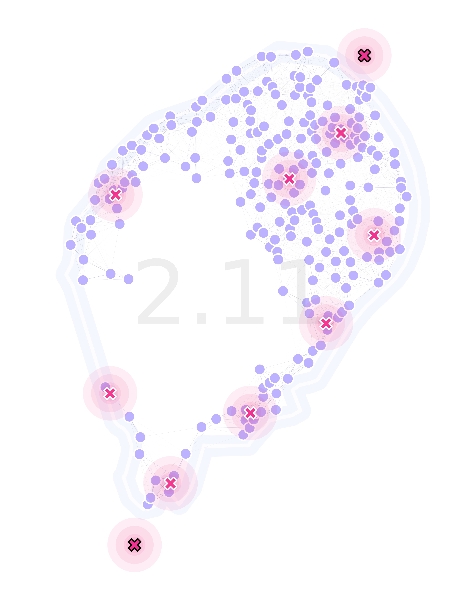

Tutorials
=====

Throughout these tutorials we will showcase and explain `MGSurvE <https://github.com/Chipdelmal/MGSurvE>`_'s features. 
From creating and updating landscapes with traps and different movement kernels, and point-types; to optimizing realistic landscapes, these demos should get us up to speed with using our package.

An important note in the tutorials that deal with optimization routines is that in most of the tutorials we have two ways to do the actual optimization routine:
registering `DEAP <https://deap.readthedocs.io/en/master/>`_'s functions by hand (as most our demos do), or by using our optimization wrappers (the also being available under the "simplified" flag in our `demos folder <https://github.com/Chipdelmal/MGSurvE/tree/main/MGSurvE/demos>`_).
We chose to use the complex version in the tutorials because it allows more flexibility, but for most cases, the simplified versions are more than enough to get landscape optimizations done.

.. toctree::
   :numbered:
   :maxdepth: 1

   landscapeCreation
   landscapeUpdate
   landscapeTraps
   GA
   GA_custom
   GA_sites
   GA_complex
   OT_trapMask
   GA_STP

Please note that the code used in all of the tutorials can be downloaded `from this link <https://github.com/Chipdelmal/MGSurvE/tree/main/MGSurvE/demos>`_.

   