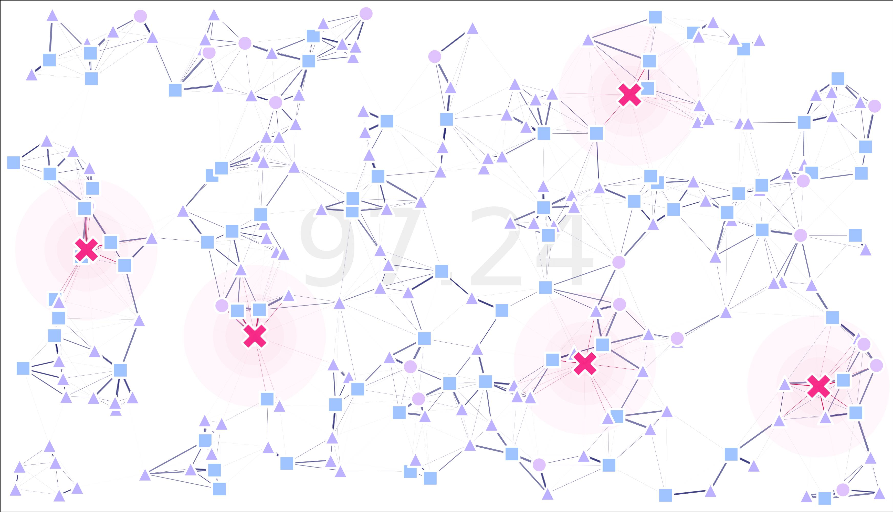

.. MGSurvE documentation master file, created by
   sphinx-quickstart on Wed Nov  3 09:01:55 2021.
   You can adapt this file completely to your liking, but it should at least
   contain the root `toctree` directive.

MGSurvE's documentation!
===================================

`MGSurvE <https://github.com/Chipdelmal/MGSurvE>`_ is a python package designed to optimize the location of mosquito traps in complex spatially-heterogeneous environments.
Have a look at our `github <https://github.com/Chipdelmal/MGSurvE>`_ repo for the latest code or `install <./installation.html>`_  our package through `pypi <https://pypi.org/project/MGSurvE/>`_.

Our `tutorials <demos.html>`_ sections contains several use-case examples!

.. note::

   This project is under active development and testing.

Features
------------

`MGSurvE <https://github.com/Chipdelmal/MGSurvE>`_ aims to be a fairly flexible utility that serves as a tool to compare and contrast effectiveness of trapping schemes in a variety of situations.
To this end, we have integrated the following features into our package (with more coming in future updates):

* Support for different point-types
* Random point-process landscape generators
* Customizable movement kernels
* Different movement kernels for male and female mosquitos
* Customizable trap attractiveness kernels
* Different attractiveness levels at specific point-type transitions
* Different trap attractiveness levels for male and female mosquitos
* Immovable traps
* Integrated plotting routines
* Integrated Map-plotting routines (for GIS geometries)
* Genetic Algorithm (GA) and Particle-Swarm Optimization (PSO) routines integration

Demos
------------

Have a look at our `YouTube playlist <https://youtube.com/playlist?list=PLRzY6w7pvIWrOSwOlu_MXbOr14wx9xuwT>`_  for some use examples!

.. raw:: html

   
<iframe width="560" height="315" src="https://www.youtube.com/embed/videoseries?list=PLRzY6w7pvIWrOSwOlu_MXbOr14wx9xuwT" title="YouTube video player" frameborder="0" allow="accelerometer; autoplay; clipboard-write; encrypted-media; gyroscope; picture-in-picture" allowfullscreen></iframe>

------------

Site's Map
------------

.. toctree::
   :maxdepth: 2

   installation
   breakdown
   demos
   benchmarks
   api

..
   comment:: Indices and tables
..
   comment:: ==================

..
   comment:: * :ref:`genindex`
..
   comment:: * :ref:`modindex`
..
   comment:: * :ref:`search`
